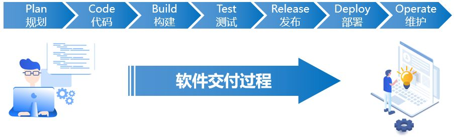
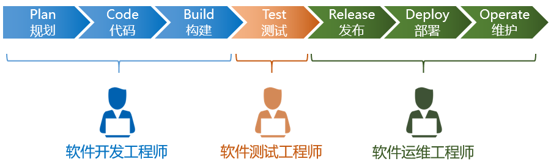
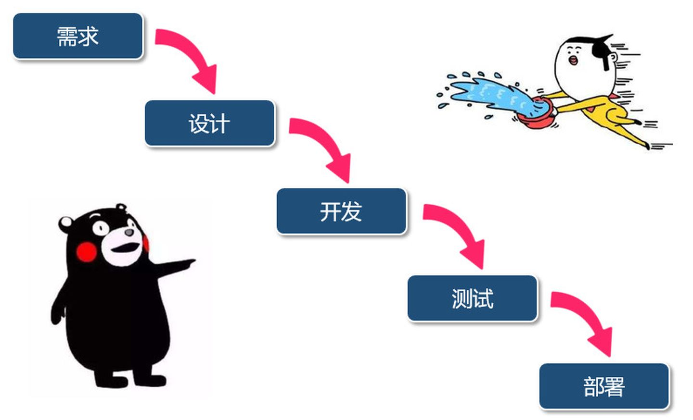
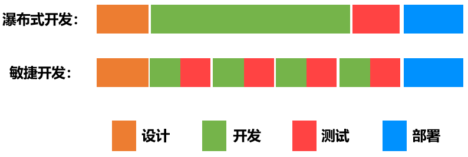
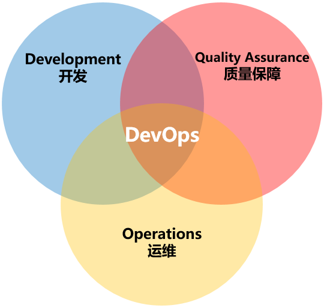
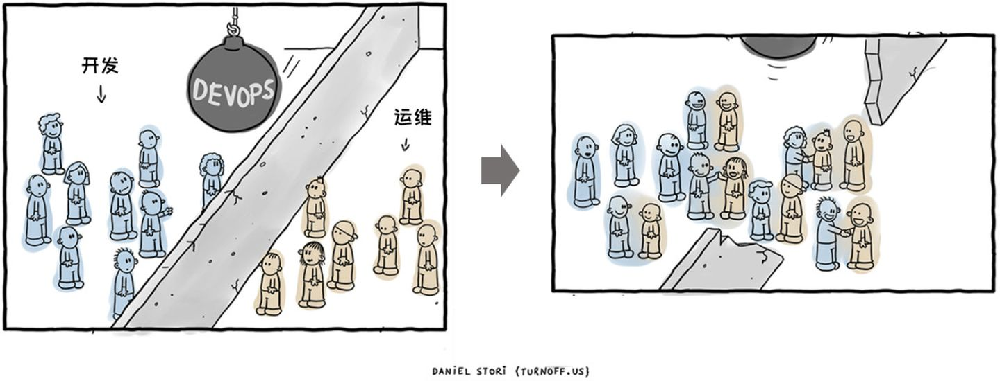
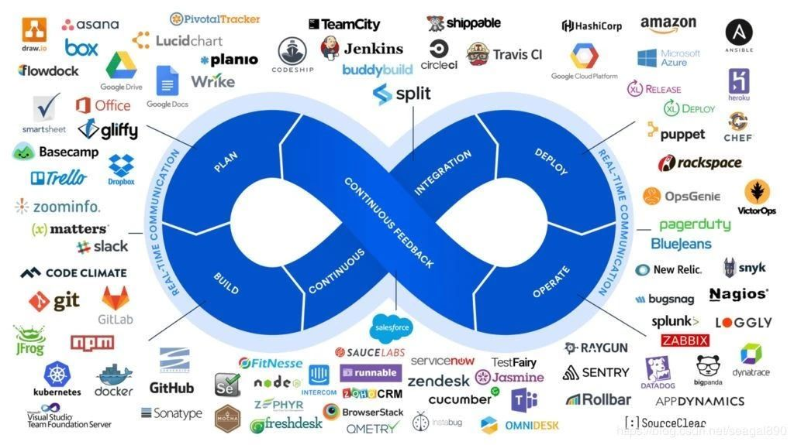
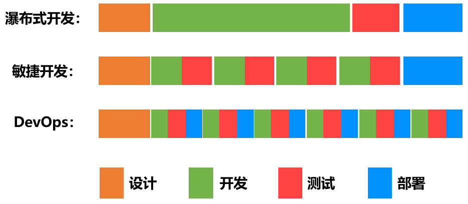
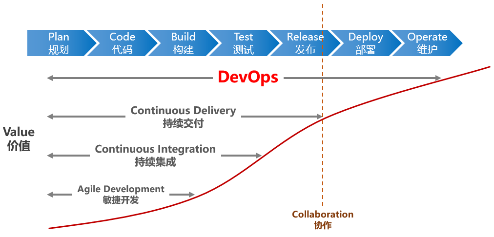
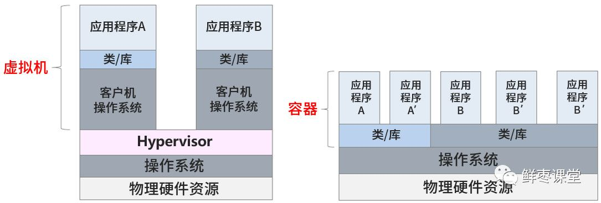

## 什么是 DevOps

### DevOps 的起源

DevOps 的起源这个故事有点长，从头开始讲起吧。上个世纪 40 年代，世界上第一台计算机诞生。从诞生之日起，它就离不开程序（Program）的驱动。而负责编写程序的人，就被称为“程序员”（Programmer）。

程序员是计算机的驾驭者，也是极其稀缺的人才。那个时候，只有高学历、名校出身的人，才有资格成为程序员，操控计算机。

随着人类科技的不断发展，PC 和 Internet 陆续问世，我们进入了全民拥抱信息化的时代。越来越多的企业开始将计算机作为办公用的工具，用以提升生产力。而普通个人用户也开始将计算机作为娱乐工具，用以改善生活品质。

于是，计算机的程序，开始变成了一门生意。程序，逐步演进为“软件（software）”，变成了最赚钱的产品之一。

在软件产业里，程序员有了更专业的称谓，叫做“软件开发工程师（Software Development Engineer）”，也就是我们常说的“码农”。

我们知道，一个软件从零开始到最终交付，大概包括以下几个阶段：规划、编码、构建、测试、发布、部署和维护。

最初，程序比较简单，工作量不大，程序员一个人可以完成所有阶段的工作。

随着软件产业的日益发展壮大，软件的规模也在逐渐变得庞大。软件的复杂度不断攀升。一个人已经 hold 不住了，就开始出现了精细化分工。

码农的队伍扩大，工种增加。除了软件开发工程师之外，又有了软件测试工程师，软件运维工程师。

分工之后，传统的软件开发流程是这样的：

软件开发人员花费数周和数月编写代码，然后将代码交给 QA（质量保障）团队进行测试，然后将最终的发布版交给运维团队去布署。所有的这三个阶段，即开发，测试，布署。

早期所采用的软件交付模型，称之为“瀑布（Waterfall）模型”。

瀑布模型，简而言之，就是等一个阶段所有工作完成之后，再进入下一个阶段。

这种模型适合条件比较理想化（用户需求非常明确、开发时间非常充足）的项目。大家按部就班，轮流执行自己的职责即可。

但是，项目不可能是单向运作的。客户也是有需求的。产品也是会有问题的，需要改进的。

随着时间推移，用户对系统的需求不断增加，与此同时，用户给的时间周期却越来越少。在这个情况下，大家发现，笨重迟缓的瀑布式开发已经不合时宜了。

于是，软件开发团队引入了一个新的概念，那就是大名鼎鼎的——“敏捷开发（Agile Development）”。

敏捷开发在 2000 年左右开始被世人所关注，是一种能应对快速变化需求的软件开发能力。其实简单来说，就是把大项目变成小项目，把大时间点变成小时间点，然后这样：

有两个词经常会伴随着 DevOps 出现，那就是 CI 和 CD。CI 是 Continuous Integration（持续集成），

而 CD 对应多个英文，Continuous Delivery（持续交付）或 Continuous Deployment（持续部署）。

美其名曰：“持续（Continuous）”，其实就是“加速——反复——加速——反复……”，这样子。画个图大家可能更明白一点：

敏捷开发大幅提高了开发团队的工作效率，让版本的更新速度变得更快。

很多人可能会觉得，“更新版本的速度快了，风险不是更大了吗？”

其实，事实并非如此。

敏捷开发可以帮助更快地发现问题，产品被更快地交付到用户手中，团队可以更快地得到用户的反馈，从而进行更快地响应。而且，DevOps 小步快跑的形式带来的版本变化是比较小的，风险会更小（如下图所示）。即使出现问题，修复起来也会相对容易一些。

虽然敏捷开发大幅提升了软件开发的效率和版本更新的速度，但是它的效果仅限于开发环节。研发们发现，运维那边，依旧是铁板一块，成为了新的瓶颈。

运维工程师，和开发工程师有着完全不同的思维逻辑。运维团队的座右铭，很简单，就是“稳定压倒一切”。运维的核心诉求，就是不出问题。

什么情况下最容易出问题？发生改变的时候最容易出问题。所以说，运维非常排斥“改变”。

于是乎，矛盾就在两者之间集中爆发了。

这个时候，我们的 DevOps，隆重登场了。

### DevOps 到底是什么

DevOps 这个词，其实就是 Development 和 Operations 两个词的组合。它的英文发音是 /de'vɒps/，类似于“迪沃普斯”。

DevOps 的维基百科定义是这样的：

DevOps 是一组过程、方法与系统的统称，用于促进开发、技术运营和质量保障（QA）部门之间的沟通、协作与整合。

这个定位稍微有点抽象，但是并不难理解。反正它不是某一个特定软件、工具或平台的名字。

从目标来看，DevOps 就是让开发人员和运维人员更好地沟通合作，通过自动化流程来使得软件整体过程更加快捷和可靠。

很多人可能觉得，所谓 DevOps，不就是 Dev+Ops 嘛，把两个团队合并，或者将运维划归开发，不就完事了嘛，简单粗暴。

注意，这个观点是不对的。这也是 DevOps 这些年一直难以落地的主要原因。

想要将 DevOps 真正落地，首先第一点，是思维转变，也就是“洗脑”。不仅是运维的要洗，开发的也要洗。员工要洗，领导更要洗。

DevOps 并不仅仅是组织架构变革，更是企业文化和思想观念的变革。如果不能改变观念，即使将员工放在一起，也不会产生火花。

除了洗脑之外，就是根据 DevOps 思想重新梳理全流程的规范和标准。在 DevOps 的流程下，运维人员会在项目开发期间就介入到开发过程中，了解开发人员使用的系统架构和技术路线，从而制定适当的运维方案。而开发人员也会在运维的初期参与到系统部署中，并提供系统部署的优化建议。

DevOps 的实施，促进开发和运维人员的沟通，增进彼此的理（gan）解（qing）。

在思维和流程改变的同时，想要充分落地 DevOps，当然离不开软件和平台的支持。

目前支持 DevOps 的软件实在是太多了。限于篇幅，就不一一介绍了。话说回来，现在 DevOps 之所以被吹得天花乱坠，也有这些软件和平台的功劳，可以趁机卖钱啊。

DevOps 生态圈中令人眼花缭乱的工具

上述这些关键要素里面，技术（工具和平台）是最容易实现的，流程次之，思维转变反而最困难。

换言之，DevOps 考验的不仅是一家企业的技术，更是管理水平和企业文化。

对比前面所说的瀑布式开发和敏捷开发，我们可以明显看出，DevOps 贯穿了软件全生命周期，而不仅限于开发阶段。

下面这张图，更明显地说明了 DevOps 所处的位置，还有它的价值：

### DevOps 与虚拟化、容器、微服务

这几年云计算技术突飞猛进，大家应该对虚拟化、容器、微服务这些概念并不陌生。当我们提到这些概念的时候，也会偶尔提及 DevOps。

它们之间有什么联系呢？

其实很简单。

大家可以设想一下，如果要对一项工作进行精细化分工，我们是对一个大铁疙瘩进行加工方便？还是拆成一块一块进行加工更加方便？

显然是拆分之后会更加方便。

所谓“微服务”，就是将原来黑盒化的一个整体产品进行拆分（解耦），从一个提供多种服务的整体，拆成各自提供不同服务的多个个体。如下图所示：

体式架构（Monolithic）→ 微服务架构（Microservices）

微服务架构下，不同的工程师可以对各自负责的模块进行处理，例如开发、测试、部署、迭代

而虚拟化，其实就是一种敏捷的云计算服务。它从硬件上，将一个系统“划分”为多个系统，系统之间相互隔离，为微服务提供便利。

容器就更彻底了，不是划分为不同的操作系统，而是在操作系统上划分为不同的“运行环境”（Container），占用资源更少，部署速度更快。

明白了吧？虚拟化和容器，其实为 DevOps 提供了很好的前提条件。开发环境和部署环境都可以更好地隔离了，减小了相互之间的影响。

这也是 DevOps 为什么 2009 年时不火，现在越来越火的一个主要原因之一。

## CI/CD 是什么？如何理解持续集成、持续交付和持续部署

CI/CD 是一种通过在应用开发阶段引入自动化来频繁向客户交付应用的方法。CI/CD 的核心概念是持续集成、持续交付和持续部署。作为一个面向开发和运营团队的解决方案，CI/CD 主要针对在集成新代码时所引发的问题（亦称：“集成地狱”）。

具体而言，CI/CD 可让持续自动化和持续监控贯穿于应用的整个生命周期（从集成和测试阶段，到交付和部署）。这些关联的事务通常被统称为“CI/CD 管道”，由开发和运维团队以敏捷方式协同支持。

### CI 是什么？CI 和 CD 有什么区别？

缩略词 CI / CD 具有几个不同的含义。CI/CD 中的“CI”始终指持续集成，它属于开发人员的自动化流程。成功的 CI 意味着应用代码的新更改会定期构建、测试并合并到共享存储库中。该解决方案可以解决在一次开发中有太多应用分支，从而导致相互冲突的问题。

CI/CD 中的“CD”指的是持续交付和/或持续部署，这些相关概念有时会交叉使用。两者都事关管道后续阶段的自动化，但它们有时也会单独使用，用于说明自动化程度。

持续交付通常是指开发人员对应用的更改会自动进行错误测试并上传到存储库（如 GitHub 或容器注册表），然后由运维团队将其部署到实时生产环境中。这旨在解决开发和运维团队之间可见性及沟通较差的问题。因此，持续交付的目的就是确保尽可能减少部署新代码时所需的工作量。

持续部署（另一种“CD”）指的是自动将开发人员的更改从存储库发布到生产环境，以供客户使用。它主要为了解决因手动流程降低应用交付速度，从而使运维团队超负荷的问题。持续部署以持续交付的优势为根基，实现了管道后续阶段的自动化。

CI/CD 既可能仅指持续集成和持续交付构成的关联环节，也可以指持续集成、持续交付和持续部署这三项构成的关联环节。更为复杂的是，有时“持续交付”也包含了持续部署流程。

归根结底，我们没必要纠结于这些语义，您只需记得 CI/CD 其实就是一个流程（通常形象地表述为管道），用于实现应用开发中的高度持续自动化和持续监控。因案例而异，该术语的具体含义取决于 CI/CD 管道的自动化程度。许多企业最开始先添加 CI，然后逐步实现交付和部署的自动化（例如作为云原生应用的一部分）。

### CI 持续集成（Continuous Integration）

现代应用开发的目标是让多位开发人员同时处理同一应用的不同功能。但是，如果企业安排在一天内将所有分支源代码合并在一起（称为“合并日”），最终可能造成工作繁琐、耗时，而且需要手动完成。这是因为当一位独立工作的开发人员对应用进行更改时，有可能会与其他开发人员同时进行的更改发生冲突。如果每个开发人员都自定义自己的本地集成开发环境（IDE），而不是让团队就一个基于云的 IDE 达成一致，那么就会让问题更加雪上加霜。

持续集成（CI）可以帮助开发人员更加频繁地（有时甚至每天）将代码更改合并到共享分支或“主干”中。一旦开发人员对应用所做的更改被合并，系统就会通过自动构建应用并运行不同级别的自动化测试（通常是单元测试和集成测试）来验证这些更改，确保这些更改没有对应用造成破坏。这意味着测试内容涵盖了从类和函数到构成整个应用的不同模块。如果自动化测试发现新代码和现有代码之间存在冲突，CI 可以更加轻松地快速修复这些错误。

### CD 持续交付（Continuous Delivery）

完成 CI 中构建及单元测试和集成测试的自动化流程后，持续交付可自动将已验证的代码发布到存储库。为了实现高效的持续交付流程，务必要确保 CI 已内置于开发管道。持续交付的目标是拥有一个可随时部署到生产环境的代码库。

在持续交付中，每个阶段（从代码更改的合并，到生产就绪型构建版本的交付）都涉及测试自动化和代码发布自动化。在流程结束时，运维团队可以快速、轻松地将应用部署到生产环境中。

### CD 持续部署（Continuous Deployment）

对于一个成熟的 CI/CD 管道来说，最后的阶段是持续部署。作为持续交付——自动将生产就绪型构建版本发布到代码存储库——的延伸，持续部署可以自动将应用发布到生产环境。由于在生产之前的管道阶段没有手动门控，因此持续部署在很大程度上都得依赖精心设计的测试自动化。

实际上，持续部署意味着开发人员对应用的更改在编写后的几分钟内就能生效（假设它通过了自动化测试）。这更加便于持续接收和整合用户反馈。总而言之，所有这些 CI/CD 的关联步骤都有助于降低应用的部署风险，因此更便于以小件的方式（而非一次性）发布对应用的更改。不过，由于还需要编写自动化测试以适应 CI/CD 管道中的各种测试和发布阶段，因此前期投资还是会很大。
