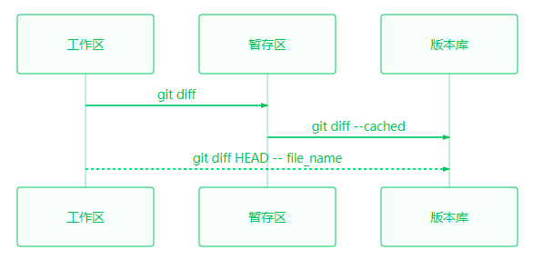
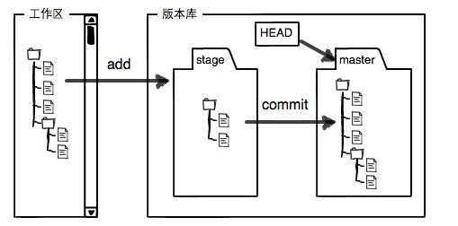
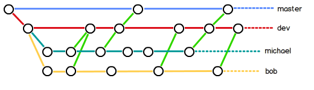

🌟官网：https://git-scm.com/book/zh/v2
# 一、安装及初始化

## 根据不同的系统，自行查找安装方法。

现在，Git可以在Linux、Unix、Mac和Windows这几大平台上正常运行了。

## 配置信息

注意**`git config`**命令的**`--global`**参数，用了这个参数，表示你这台机器上所有的Git仓库都会使用这个配置，当然也可以对某个仓库指定不同的用户名和Email地址。
``` bash
$ git config --global user.name "Your Name"
$ git config --global user.email "email@example.com"
```
当然也可以通过命令行的方式(即要去掉--global参数)去设置单独的git配置，只需要在 .git 文件夹下（cd .git）。 例如执行如下命令：`git  config  user.name  "xxxxx"` `git  config  user.email  "xxxxx"`就设置了单独配置。

## 添加文件到git仓库repository

**所有的版本控制系统，其实只能跟踪文本文件的改动，比如TXT文件，网页，所有的程序代码等等，Git也不例外。**

如果没有历史遗留问题，强烈建议使用标准的UTF-8编码，所有语言使用同一种编码，既没有冲突，又被所有平台所支持。

``` bash
$ git add readme.txt
$ git commit -m "wrote a readme file"
```

为什么Git添加文件需要`add`，`commit`一共两步呢？

- 因为`commit`可以一次提交很多文件，所以你可以多次`add`不同的文件，

### 小结

现在总结一下今天学的两点内容：

初始化一个Git仓库，使用`git init`命令。

添加文件到Git仓库，分两步：

1. 使用命令`git add <file>`，注意，可反复多次使用，添加多个文件；(添加全部用`git add .`)
2. 使用命令`git commit -m <message>`，完成。

# 二、时光机穿梭


- 要随时掌握工作区的状态，使用`git status`命令。
- 如果`git status`告诉你有文件被修改过，用`git diff`可以查看修改内容。
- git diff 是只比较比较工作区和暂存区（最后一次add）的区别，git diff --cached 是只比较暂存区和版本库的区别，git diff HEAD -- filename 是只比较工作区和版本库（最后一次commit）的区别。三种比较各对应不同命令的。



## 版本回退

在Git中，用`HEAD`表示当前版本，也就是最新的提交`1094adb...`（注意我的提交ID和你的肯定不一样），上一个版本就是`HEAD^`，上上一个版本就是`HEAD^^`，当然往上100个版本写100个`^`比较容易数不过来，所以写成`HEAD~100`。

- `HEAD`指向的版本就是当前版本，因此，Git允许我们在版本的历史之间穿梭，使用命令`git reset --hard commit_id`(或HEAD）。版本号没必要写全，前几位就可以了，Git会自动去找。
- 穿梭前，用`git log`可以查看提交历史，以便确定要回退到哪个版本。如果嫌输出信息太多，用`git log --pretty=oneline`命令优雅输出。
- 要重返未来，用`git reflog`查看命令历史，以便确定要回到未来的哪个版本。

## 工作区跟暂存区

Git的版本库里存了很多东西，其中最重要的就是称为stage（或者叫index）的暂存区，还有Git为我们自动创建的第一个分支`master`，以及指向`master`的一个指针叫`HEAD`。



## 管理修改

第一次修改 -> `git add` -> 第二次修改 -> `git add` -> `git commit`

## 撤销修改

场景1：当你改乱了工作区某个文件的内容，想直接丢弃工作区的修改时，用命令`git checkout -- file`。

场景2：当你不但改乱了工作区某个文件的内容，还添加到了暂存区时，想丢弃修改，分两步，第一步用命令`git reset HEAD <file>`，就回到了场景1（也就是讲暂存区的file恢复到工作区），第二步按场景1操作。

场景3：已经提交了不合适的修改到版本库时，想要撤销本次提交，参考[版本回退](#版本回退)一节，不过前提是没有推送到远程库。

## 删除文件

一般情况下，你通常直接在文件管理器中把没用的文件删了，或者用`rm`命令删了：`$ rm test.txt`

命令`git rm`用于从版本库中删除一个文件。如果一个文件已经被提交到版本库，那么你永远不用担心误删，但是要小心，你只能恢复文件到最新版本，你会丢失**最近一次提交后你修改的内容**。

`git rm HelloWorld.class —cached` 删除缓存区中的文件。

`git checkout commit_id 文件名`其实是用版本库里的版本替换工作区的版本，无论工作区是修改还是删除，都可以“一键还原”。

# 三、远程仓库

## 添加远程库

### 小结

要关联一个远程库，使用命令`git remote add origin git@server-name:path/repo-name.git`；

关联后，使用命令`git push -u origin master`第一次推送master分支的所有内容；

删除已有的GitHub远程库:`git remote rm origin`；

此后，每次本地提交后，只要有必要，就可以使用命令`git push origin master`推送最新修改；

>  强制推送：`git push -f origin master`

分布式版本系统的最大好处之一是在本地工作完全不需要考虑远程库的存在，也就是有没有联网都可以正常工作，而SVN在没有联网的时候是拒绝干活的！当有网络的时候，再把本地提交推送一下就完成了同步，真是太方便了！

新电脑第一次推送到远程仓库，报错：

``` bash
$ git push -u origin master
Warning: Permanently added the RSA host key for IP address 'xx.xxx.xxx.xx' to the list of known hosts.
git@github.com: Permission denied (publickey).
fatal: Could not read from remote repository.

Please make sure you have the correct access rights
and the repository exists.
```

解决办法：

1. 首先你要检测自己电脑是否存在 SSH key ，在终端输出: `ls -al ~/.ssh`

2. 没有的，在终端输入`ssh-keygen -t rsa -C "your_email@example.com"`，三个回车

3. 添加SSH key 到Github 上，直接 终端输入：

   - 一种找到内容id_rsa.pub，

     - 打开复制`vim ~/.ssh/id_rsa.pub`。	
     - ``` bash
       cd .ssh
       ls
       cat id_rsa.pub
       ```

   - 一种用命令行，终端显示：

     - `pbcopy < ~/.ssh/id_rsa.pub`


4. 检测SSH key: 输入命令：`ssh git@github.com`

## 从远程库克隆

要克隆一个仓库，首先必须知道仓库的地址，然后使用`git clone`命令克隆。

Git支持多种协议，包括`https`，但通过`ssh`支持的原生`git`协议速度最快。使用`https`除了速度慢以外，还有个最大的麻烦是每次推送都必须输入口令，但是在某些只开放http端口的公司内部就无法使用`ssh`协议而只能用`https`。

# 四、分支管理

## 创建与合并分支

Git鼓励大量使用分支：

查看分支：`git branch` 查看远程加 -a

创建分支：`git branch <name>`

切换分支：`git checkout <name>`

创建+切换分支：`git checkout -b <name>`

合并某分支到当前分支：`git merge <name>`

删除分支：`git branch -d <name>`

## 解决冲突

当Git无法自动合并分支时，就必须首先解决冲突。解决冲突后，再提交，合并完成。

解决冲突就是把Git合并失败的文件手动编辑为我们希望的内容，再提交。

用`git log --graph`命令可以看到分支合并图。`$ git log --graph --pretty=oneline --abbrev-commit`

## 分支管理策略

在实际开发中，我们应该按照几个基本原则进行分支管理：

首先，`master`分支应该是非常稳定的，也就是仅用来发布新版本，平时不能在上面干活；

那在哪干活呢？干活都在`dev`分支上，也就是说，`dev`分支是不稳定的，到某个时候，比如1.0版本发布时，再把`dev`分支合并到`master`上，在`master`分支发布1.0版本；

你和你的小伙伴们每个人都在`dev`分支上干活，每个人都有自己的分支，时不时地往`dev`分支上合并就可以了。

所以，团队合作的分支看起来就像这样：



### 小结

Git分支十分强大，在团队开发中应该充分应用。

合并分支时，加上`--no-ff`参数就可以用普通模式合并，合并后的历史有分支，能看出来曾经做过合并，而`fast forward`合并就看不出来曾经做过合并。`$ git merge --no-ff -m "merge with no-ff" dev`

## Bug 分支

修复bug时，我们会通过创建新的bug分支进行修复，然后合并，最后删除；

当手头工作没有完成时，先把工作现场`git stash`一下，然后去修复bug，修复后，再`git stash pop`，回到工作现场。

一种是用`git stash apply`恢复，但是恢复后，stash内容并不删除，你需要用`git stash drop`来删除；

另一种方式是用`git stash pop`，恢复的同时把stash内容也删了；再用`git stash list`查看，就看不到任何stash内容了：

## Feature 分支

开发一个新feature，最好新建一个分支；

如果要丢弃一个没有被合并过的分支，可以通过`git branch -D <name>`强行删除。

## 多人协作

1. 但是，并不是一定要把本地分支往远程推送，那么，哪些分支需要推送，哪些不需要呢？

	- `master`分支是主分支，因此要时刻与远程同步；
	- `dev`分支是开发分支，团队所有成员都需要在上面工作，所以也需要与远程同步；
	- bug分支只用于在本地修复bug，就没必要推到远程了，除非老板要看看你每周到底修复了几个bug；
	- feature分支是否推到远程，取决于你是否和你的小伙伴合作在上面开发。

总之，就是在Git中，分支完全可以在本地自己藏着玩，是否推送，视你的心情而定！

2. 因此，多人协作的工作模式通常是这样：
   1. 首先，可以试图用`git push origin <branch-name>`推送自己的修改；
   2. 如果推送失败，则因为远程分支比你的本地更新，需要先用`git pull`试图合并；
   3. 如果合并有冲突，则解决冲突，并在本地提交；
   4. 没有冲突或者解决掉冲突后，再用`git push origin <branch-name>`推送就能成功！
   5. 第二种办法强制推送`git push origin master -f`；

如果`git pull`提示`no tracking information`，则说明本地分支和远程分支的链接关系没有创建，用命令`git branch --set-upstream-to origin/<branch-name> <branch-name>`。

这就是多人协作的工作模式，一旦熟悉了，就非常简单。

### 小结

- 查看远程库信息，使用`git remote -v`；
- 本地新建的分支如果不推送到远程，对其他人就是不可见的；
- 从本地推送分支，使用`git push origin branch-name`，如果推送失败，先用`git pull`抓取远程的新提交；
- 在本地创建和远程分支对应的分支，使用`git checkout -b branch-name origin/branch-name`，本地和远程分支的名称最好一致；（这里已经建立关联了）
- 建立本地分支和远程分支的关联，使用`git branch --set-upstream-to=origin/branch-name branch-name `；
- 从远程抓取分支，使用`git pull`，如果有冲突，要先处理冲突。

## Rebase

- rebase操作可以把本地未push的分叉提交历史整理成直线；

- rebase的目的是使得我们在查看历史提交的变化时更容易，因为分叉的提交需要三方对比。

# 五、标签管理

Git的标签虽然是版本库的快照，但其实它就是指向某个commit的指针（跟分支很像对不对？但是分支可以移动，标签不能移动），所以，创建和删除标签都是瞬间完成的。tag就是一个让人容易记住的有意义的名字，它跟某个commit绑在一起。

## 创建标签

- 命令`git tag <tagname>`用于新建一个标签，默认为`HEAD`，也可以指定一个commit id；

- 命令`git tag -a <tagname> -m "blablabla..." commit_id`可以指定标签信息；

- 命令`git tag`可以查看所有标签。

## 操作标签

- 命令`git push origin <tagname>`可以推送一个本地标签；
- 命令`git push origin --tags`可以推送全部未推送过的本地标签；
- 命令`git tag -d <tagname>`可以删除一个本地标签；
- 命令`git push origin :refs/tags/<tagname>`可以删除一个远程标签。

  # 六、使用github 与码云

- 在GitHub上，可以任意Fork开源仓库；
- 自己拥有Fork后的仓库的读写权限；
- 可以推送pull request给官方仓库来贡献代码。

因为git本身是分布式版本控制系统，可以同步到另外一个远程库，当然也可以同步到另外两个远程库。

使用多个远程库时，我们要注意，git给远程库起的默认名称是`origin`，如果有多个远程库，我们需要用不同的名称来标识不同的远程库。

``` bash
git remote rm origin
git remote add github git@server-name:path/repo-name.git.git
git remote add gitee git@server-name:path/repo-name.git.git
git remote -v
	gitee    git@server-name:path/repo-name.git (fetch)
	gitee    git@server-name:path/repo-name.git (push)
	github    git@server-name:path/repo-name.git (fetch)
	github    git@server-name:path/repo-name.git (push)
git push github master
git push gitee master
```
这样一来，我们的本地库就可以同时与多个远程库互相同步：
```ascii
┌─────────┐ ┌─────────┐
│ GitHub  │ │  Gitee  │
└─────────┘ └─────────┘
     ▲           ▲
     └─────┬─────┘
           │
    ┌─────────────┐
    │ Local Repo  │
    └─────────────┘
```

# 七、自定义git

让Git显示颜色，会让命令输出看起来更醒目：

`$ git config --global color.ui true`

推荐使用iterm2 配置。

## 忽略特殊文件

在Git工作区的根目录下创建一个特殊的`.gitignore`文件，然后把要忽略的文件名填进去，Git就会自动忽略这些文件。

不需要从头写`.gitignore`文件，GitHub已经为我们准备了各种配置文件，只需要组合一下就可以使用了。所有配置文件可以直接在线浏览：<https://github.com/github/gitignore>。

忽略文件的原则是：

1. 忽略操作系统自动生成的文件，比如缩略图等；
2. 忽略编译生成的中间文件、可执行文件等，也就是如果一个文件是通过另一个文件自动生成的，那自动生成的文件就没必要放进版本库，比如Java编译产生的`.class`文件；
3. 忽略你自己的带有敏感信息的配置文件，比如存放口令的配置文件。

例子：

```
# Windows:
Thumbs.db
ehthumbs.db
Desktop.ini

# Python:
*.py[cod]
*.so
*.egg
*.egg-info
dist
build

# My configurations:
db.ini
deploy_key_rsa
```

如果你确实想添加该文件，可以用`-f`强制添加到Git：`$ git add -f App.class`

或者你发现，可能是`.gitignore`写得有问题，需要找出来到底哪个规则写错了，可以用`git check-ignore`命令检查：`$ git check-ignore -v App.class`

## 配置别名

```bash
$ git config --global alias.st status
$ git config --global alias.co checkout
$ git config --global alias.ci commit
$ git config --global alias.br branch
$ git config --global alias.unstage 'reset HEAD'
$ git config --global alias.last 'log -1'
git config --global alias.lg "log --color --graph --pretty=format:'%Cred%h%Creset -%C(yellow)%d%Creset %s %Cgreen(%cr) %C(bold blue)<%an>%Creset' --abbrev-commit"
```