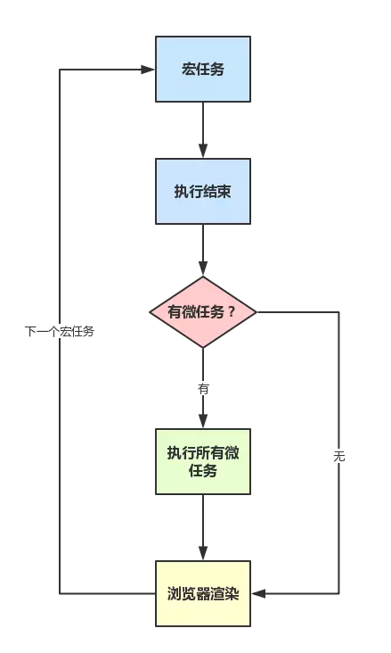

## 浏览器线程
- js运作在浏览器中,是单线程的，即js代码始终在一个线程上执行，这个线程称为js引擎线程。

- 浏览器是多线程的，除了js引擎线程，它还有：
  1. UI渲染线程
  2. 浏览器事件触发线程
  3. http请求线程
  4. EventLoop轮询的处理线程
  5. ……

这些线程的作用：

- UI线程用于渲染页面

- js线程用于执行js任务

- 浏览器事件触发线程用于控制交互，响应用户

- http线程用于处理请求，ajax是委托给浏览器新开一个http线程

- EventLoop处理线程用于轮询消息队列

浏览器中的js任务:

>执行JavaScript代码
>
>对用户的输入（包含鼠标点击、键盘输入等等）做出反应
>
>处理异步的网络请求

## js单线程
- 单线程的含义是js只能在一个线程上运行，也就说，js同时只能执行一个js任务，其它的任务则会排队等待执行。

- js是单线程的,并不代表js引擎线程只有一个。js引擎有多个线程，一个主线程，其它的后台配合主线程。

- 多线程之间会共享运行资源，浏览器端的js会操作dom，多个线程必然会带来同步的问题，所有js核心选择了单线程来避免处理这个麻烦。js可以操作dom，影响渲染，所以js引擎线程和UI线程是互斥的。这也就解释了js执行时会阻塞页面的渲染。

## 消息队列(任务队列)
> JavaScript运行时，除了一个运行线程，引擎还提供一个消息队列，里面是各种需要当前程序处理的消息。新的消息进入队列的时候，会自动排在队列的尾端。

消息和回调函数相互联系:

单线程意味着js任务需要排队，如果前一个任务出现大量的耗时操作，后面的任务得不到执行，任务的积累会导致页面的“假死”。这也是js编程一直在强调需要回避的“坑”。

## js任务

任务分为2种:

- 同步任务
- 异步任务

它们的区别是: 本段中的线程指的是js引擎主线程

- 同步任务：在主线程排队支持的任务，前一个任务执行完毕后，执行后一个任务,形成一个执行栈，线程执行时在内存形成的空间为栈，进程形成堆结构，这是内存的结构。执行栈可以实现函数的层层调用。注意不要理解成同步代码进入栈中，按栈的出栈顺序来执行。

- 异步任务会被主线程挂起，不会进入主线程，而是进入消息队列，而且必须指定回调函数，只有消息队列通知主线程，并且执行栈为空时，该消息对应的任务才会进入执行栈获得执行的机会。

主线程执行的说明: 【js的运行机制】

1. 所有同步任务都在主线程上执行，形成一个执行栈。
2. 主线程之外，还存在一个”任务队列”。只要异步任务有了运行结果，就在”任务队列”之中放置一个事件。
3. 一旦”执行栈”中的所有同步任务执行完毕，系统就会读取”任务队列”，看看里面有哪些事件。那些对应的异步任务，于是结束等待状态，进入执行栈，开始执行。
4. 主线程不断重复上面的第三步。

执行栈中的代码（同步任务），总是在读取”任务队列”（异步任务）之前执行。

## 事件和回调函数

- 消息队列队列(或者叫任务队列）是一个事件的队列，IO响应时，会往队列中添加一个消息，此时说明相关的异步代码到了执行的时机，可以进入主线程的执行栈了。主线程读取消息队列，可以读取到对应的事件。

- 消息队列可以响应IO事件，还有用户产生的事件（比如点击鼠标，页面滚动），只要指定了回调函数，就会进入消息队列，等待EventLoop轮询线程处理，是否可以进入主线程的执行栈。

- 消息和回调函数相互联系的含义：主线程读到消息，就会执行相应的回调函数；进入消息队列的消息，必须对应相应的回调函数，否则这个消息会被丢弃不会进入消息队列。

- 消息队列是一个先进先出的队列结构，这就决定了它的执行顺序，先产生的消息会被主线程先读取，会不会执行则会先检查一下执行时间，因为存在setTimeout等定时函数，这类事件产生的消息进入到消息队列，被执行的时机取决与它在队列中的位置和执行时间有关。

## EventLoop

主线程从”任务队列”中读取事件，这个过程是循环不断的，所以整个的这种运行机制又称为Event Loop（事件循环）。

简单说，浏览器的两个线程：一个负责程序本身的运行，称为”主线程”；另一个负责主线程与其他进程（主要是各种I/O操作）的通信，被称为”Event Loop线程”（可以译为”消息线程”）。

由于js是运行在单线程上的，所有浏览器单独开启一个线程来处理事件消息的轮询，避免阻塞js的执行。

**异步代码的执行逻辑：**

每当遇到I/O的时候，主线程就让EventLoop线程去通知相应的I/O程序，然后接着往后运行，所以不存在等待时间。等到I/O程序完成操作，EventLoop线程把消息添加到消息队列，主线程就调用事先设定的回调函数，完成整个任务。

- JavaIO中包括了网络IO，我们通常把http请求归类为网络IO.

- js的ajax是new XMLHttpRequest()对象实现的，浏览器会新开一个线程来处理http请求，这就是ajax能够实现局部刷新的同时，还能响应用户交互的原因。

这也说明了在处理IO时，浏览器通常会新开启IO线程，这个属于我的推测，并没有查到对应的资料，因为IO涉及的广泛，这话也没错。

## 定时器
  前面也提到了定时器，定时器是会在进入消息队列，这也就和异步代码的执行逻辑一样了。它在”消息队列”的尾部添加一个消息，因此要等到同步任务和”消息队列”现有的任务都处理完，才会得到执行的机会，还要看定时器设置的时间是否到了才会执行。

上文中将JS事件循环机制梳理了一遍，在ES5的情况是够用了，但是在ES6盛行的现在，仍然会遇到一些问题，譬如下面这题：
``` js
console.log('script start');

setTimeout(function() {
    console.log('setTimeout');
}, 0);

Promise.resolve().then(function() {
    console.log('promise1');
}).then(function() {
    console.log('promise2');
});

console.log('script end');
```
复制代码嗯哼，它的正确执行顺序是这样子的：
``` js
script start
script end
promise1
promise2
setTimeout
```

复制代码为什么呢？因为Promise里有了一个一个新的概念：microtask

或者，进一步，JS中分为两种任务类型：macrotask和microtask，在ECMAScript中，microtask称为jobs，macrotask可称为task

它们的定义？区别？简单点可以按如下理解：


- macrotask（又称之为宏任务），可以理解是每次执行栈执行的代码就是一个宏任务（包括每次从事件队列中获取一个事件回调并放到执行栈中执行）

  - 每一个task会从头到尾将这个任务执行完毕，不会执行其它

  - 浏览器为了能够使得JS内部task与DOM任务能够有序的执行，会在一个task执行结束后，在下一个 task 执行开始前，对页面进行重新渲染（task->渲染->task->...）

- microtask（又称为微任务），可以理解是在当前 task 执行结束后立即执行的任务

  - 也就是说，在当前task任务后，下一个task之前，在渲染之前

  - 所以它的响应速度相比setTimeout（setTimeout是task）会更快，因为无需等渲染

  - 也就是说，在某一个macrotask执行完后，就会将在它执行期间产生的所有microtask都执行完毕（在渲染前）

分别怎么样的场景会形成macrotask和microtask呢？

- macrotask：主代码块，setTimeout，setInterval等（可以看到，事件队列中的每一个事件都是一个macrotask）

- microtask：Promise，process.nextTick等


补充：**在node环境下，process.nextTick的优先级高于Promise，**也就是可以简单理解为：在宏任务结束后会先执行微任务队列中的nextTickQueue部分，然后才会执行微任务中的Promise部分。

再根据线程来理解下：

- macrotask中的事件都是放在一个事件队列中的，而这个队列由事件触发线程维护

- microtask中的所有微任务都是添加到微任务队列（Job Queues）中，等待当前macrotask执行完毕后执行，而这个队列由JS引擎线程维护（这点由自己理解+推测得出，因为它是在主线程下无缝执行的）

所以，总结下运行机制：

- 执行一个宏任务（栈中没有就从事件队列中获取）

- 执行过程中如果遇到微任务，就将它添加到微任务的任务队列中

- 宏任务执行完毕后，立即执行当前微任务队列中的所有微任务（依次执行）

- 当前宏任务执行完毕，开始检查渲染，然后GUI线程接管渲染

- 渲染完毕后，JS线程继续接管，开始下一个宏任务（从事件队列中获取）

如图：



另外，请注意下Promise的polyfill与官方版本的区别：

- 官方版本中，是标准的microtask形式

- polyfill，一般都是通过setTimeout模拟的，所以是macrotask形式

- 请特别注意这两点区别

注意，有一些浏览器执行结果不一样（因为它们可能把microtask当成macrotask来执行了），

但是为了简单，这里不描述一些不标准的浏览器下的场景（但记住，有些浏览器可能并不标准）